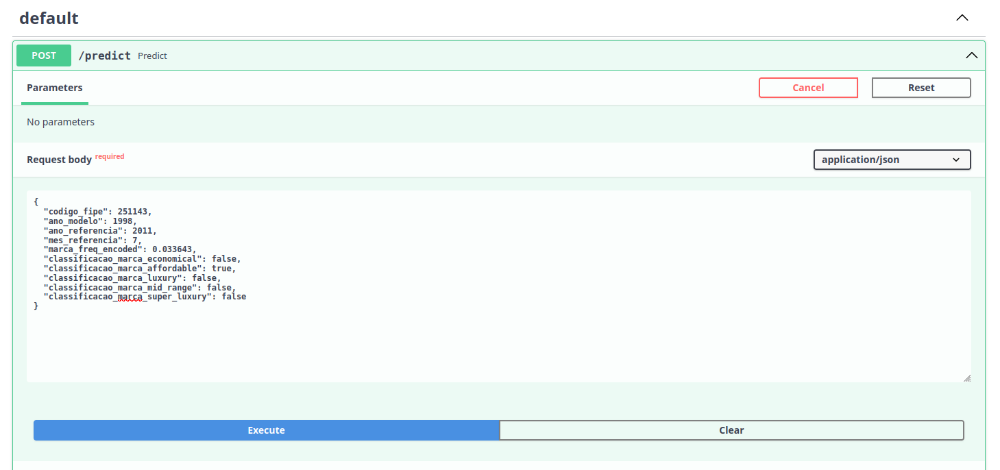
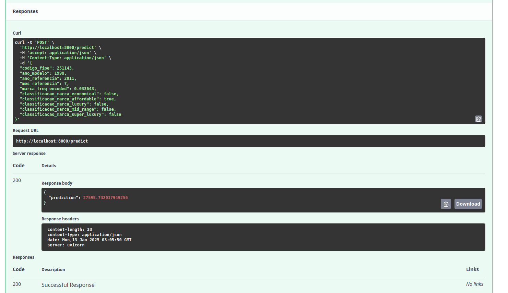

# FIPE Table - Historical Vehicle Price Data
## Overview
This Regression Machine Learning project was developed as part of the DataTalks Machine Learning Zoomcamp certification (2024 cohort). Its objective is to predict the values of second-hand cars based on their year of manufacture, brand, and model, using the FIPE Table—the standard reference for vehicle pricing in Brazil.

The FIPE Table's primary function is to calculate the average prices of vehicles (cars, motorcycles, and trucks) for each model and version across Brazil. It serves as the main reference for negotiations or valuations, offering consumers guidance on what constitutes a fair buying or selling price for a given vehicle. The values are estimated based on a survey of vehicle prices and are updated monthly. The prices reflect the average values being negotiated in the market, with adjustments depending on variables such as the vehicle's condition, manufacturer, year, model, region, optional features, color, and other relevant factors. In addition to being a benchmark for retailers and dealers, the FIPE Table is used by insurance companies to calculate indemnities in cases of theft or total loss, as well as for insurance policy pricing and tax calculations, such as the IPVA (Vehicle Property Tax).

1. The FIPE Table expresses average prices for cash transactions in resale markets targeting individual consumers across Brazil. It is intended as a negotiation or valuation parameter. Actual transaction prices may vary depending on the region, vehicle condition, color, accessories, or other factors influencing supply and demand for a specific vehicle.
2. The vehicle year refers to the model year, excluding vehicles designed for professional or special purposes.
3. Prices are expressed in BRL (Brazilian reais) for the referenced month and year.

### What is FIPE?
The Fundação Instituto de Pesquisas Econômicas (FIPE) is a private, non-profit organization established in 1973. It supports public and private educational and research institutions, particularly the Department of Economics at FEA-USP (São Paulo University). 
FIPE is recognized for its significant contributions to education, research, project development, and the creation of economic and financial indicators.

### **Disclaimer for the evaluation of this project**
We tried to follow the steps from each of the lessons, but we made some modifications because I was looking for an opportunity to experiment with different technologies and steps, and the project turned out to be the ideal opportunity for that. 
Below are the most important modifications:

   1. **Package Management**
   This project uses Poetry as the package manager instead of Pipenv. As a result, the project includes a pyproject.toml file and a poetry.lock file, replacing the traditional Pipfile and Pipfile.lock used with Pipenv. Since there was plenty of room for experimentation, the pyproject.toml file initially contained many libraries that weren't necessary for the final training and deployment of the ML model. To save time for the project evaluators, the libraries imported with Poetry have been limited to only those required. If anyone wishes to replicate all the steps from the notebooks, please remember to add the necessary libraries using the command poetry add [library_name].

   2. **Feature Transformation**
   Similar to the approach in the Midterm project, instead of using the DictVectorizer class to transform feature-value mappings into vectors, I used the Pipeline class. This approach enables the application of various encoding methods while maintaining a structured and organized transformation workflow for the dataset.

   3. **Hyperparameter Tuning and Cross-Validation**
   For parameter evaluation and cross-validation, I used different techniques such as GridSearchCV, BayesianSearchCV from Scikit-Learn and Scikit-Optimizer, and even a simple hold-out dataset. While the instructions were followed consistently with standard practices, I streamlined the process by leveraging these versatile methods.

   4. **Separate Notebooks**
   To address the unique preprocessing requirements of different Machine Learning models, I created separate notebooks. The first focuses on linear models, the second on tree-based and gradient-boosting models, and the third is dedicated to a neural network. This structure was designed to keep the workflows organized, and I recommend considering this separation during the project evaluation. Detailed explanations of the entire process are provided in the notebook subsection below.

   5. **ML Model**
   The best performance was achieved with a Random Forest model, which is approximately half a gigabyte in size. This size could be problematic for those evaluating this project, as running the entire process from a Dockerfile took over an hour, which may not be feasible for everyone. Therefore, the implementation of the second-best model, a Neural Network built with PyTorch, was prioritized for this project. However, deployment issues arose, leading to the selection of the third-best model, LightGBM, for deployment. Once the evaluation and the Zoomcamp are complete, the deployment of the Neural Network will be a priority.

## Dataset
The dataset provides a historical record of vehicle prices extracted from the official FIPE (Fundação Instituto de Pesquisas Econômicas) Table through its public consultation platform: [FIPE Vehicle Prices](). The dataset for this project was downloaded from [Tabela Fipe - Histórico de Preços Kaggle Competition](https://www.kaggle.com/datasets/franckepeixoto/tabela-fipe?select=tabela-fipe-historico-precos.csv) and contains 

### Numerical Features
|   **Feature**   |                    **Description**                 |
|-----------------|----------------------------------------------------|
| `anoModelo`     |          The manufacturing year of the vehicle     |
| `mesReferencia` | The month in which the average price was published |
| `anoReferencia` | The year in which the average price was published  |

### Categorical Features
| **Feature**     | **Description**                                           |  
|-----------------|-----------------------------------------------------------|  
| `codigoFipe`    | Internal code maintained by FIPE to identify the vehicle. |  
| `marca`         | The name of the vehicle's brand.                          |  
| `modelo`        | The specific model of the vehicle.                        |

### Target Feature
| **Feature** | **Description**                     |  
|-------------|-------------------------------------|  
| `valor`     | The average price of the vehicle.   |  

## Tools
- Poetry
- Python 3.10
- Pytorch
- Docker
- Kubernetes

## Requirements
The Python dependencies required to run this project are specified in the [pyproject.toml](./pyproject.toml) file. Additionally, Docker and Kubernetes (the deployment is done with Kind and kubectl) must be installed to execute the full scope of the project.

## **How to reproduce this project?**
1. Clone this repository
2. Install Poetry, Docker and Kind (it works with kubectl as well)
3. Build Docker image with `docker build -t fastapi-server .`
4. Create cluster with Kind `kind create cluster --name fastapi-cluster`
5. Load Docker image with Kind `kind load docker-image fastapi-server --name fastapi-cluster`
6. Apply the yaml files with kubectl `kubectl apply -f deployment.yaml && kubectl apply -f service.yaml`
7. Verify the status of everything `kubectl get pods` and `kubectl get svc`
8. Port-forward to access `kubectl port-forward service/fastapi-service 8000:80`
9. Make the requisition using Swagger UI via webrowser `localhost:8000/docs`
The requisition can be made selecting the **POST /predict button** and then **Try it out**. The requisition is made in a JSON format filling the features like this:

And then, below, the prediction will be displayed:

## Notebooks  
As this is an iterative process, different notebooks were produced to train various models and experiment with different approaches.  

### Notebook1  
A notebook detailing the process of data preparation, exploration, training, and evaluation can be found in [notebook1](./final_project/notebook1.ipynb). It includes:  

1. **Data Reading and Cleaning**: The dataset was loaded from a local `.csv` file, and headers and strings were transformed into snake case.  

2. **Feature Engineering**: A new feature was created for this project: `classificacao_marca`, which categorizes the mean values of `valor` by the `marca` feature. After this, the data was split into train, test, and validation sets.  

3. **Exploratory Data Analysis**:  
   Central tendency and data dispersion measures were analyzed. Categorical data was explored by examining the ratio of the target variable (`valor`). For numerical features, correlation with the target variable was evaluated, and a heatmap of these relationships was plotted.  

4. **Feature Selection**:  
   To enhance the understanding of the relationships in the data, a permutation importance study was performed using a LightGBM model to analyze the mean and standard deviation of feature importance. Additionally, SHAP values were used to assess the impact of features on the target variable (`valor`). Based on these analyses, the features `marca`, `anoModelo`, and `anoReferencia` were selected.  

5. **Training Models**:  
   Different linear models were trained: linear regression, as well as ridge and lasso regularizations.  

6. **Model Tuning**:  
   The final ridge model was tuned and cross-validated with `GridSearchCV`.

### Notebook2
A notebook detailing the process of data preparation, exploration, training, and evaluation can be found in [notebook2](./final_project/notebook2.ipynb). It contains the same steps from the notebook1, exceptions includes:  

2. **Feature Engineering**: no normalization was applied to the target feature, as this was not needed because of the nature of tree and gradient based models. Also, the numerical features was not scaled as well.  

5. **Training Models**:  
   Different ensemble learning models were trained: random forest, lightgbm and catboost.  

6. **Model Tuning**:  
   The final random forest model, tuned and cross-validated with `BayesianSearchCV` was a bit heavy and it would take a lot of resources to be replicated. The LightGBM was tuned, instead, with the same process.

### Notebook3
A notebook detailing the process of data preparation, exploration, training, and evaluation can be found in [notebook3](./final_project/notebook3.ipynb). It contains the same steps from the notebook1, excepetions includes:  

4. **Spliting Data**: the target feature was normalized to help the neural network model to learn better from the training data. The `marca` feature was label encoded and the model received a layer with embeddings from this feature.

5. **Training Neural Network**:  
   A neural network was trained with three layers plus an embedding layer containing the encoded data. It was tested against a holdout dataset to detect the RMSE.

## Scripts
### train.py
This file is responsible for training a LightGBM model to predict `valor` values based on several features, with steps for data preprocessing, hyperparameter tuning, and saving the final model along with its preprocessor.

First, the data is loaded from a .csv file, cleaned, and prepared by transforming columns to lower case and removing missing or duplicate entries. The data is split into training, validation, and test sets to allow model training and evaluation.

For preprocessing, the code defines separate transformations for categorical and numerical columns. Categorical columns are encoded using a combination of OneHotEncoder and LabelEncoder. These transformations are then bundled into a preprocessing pipeline. Then, the model is trained with a set of parameters gathered and tested previously. The pipeline integrates both preprocessing and model training steps, ensuring that all data transformations are applied consistently.

After training, the model is saved using pickle, enabling future use for predictions.

### predict.py
The predict.py code is designed to deploy the trained XGBoost model as an API using FastAPI. The script loads the trained model and the preprocessor from a previously saved pickle file, which allows it to make predictions on new data inputs.

First, the model is loaded into memory. The FastAPI framework is then used to define an API endpoint that receives prediction requests. The input data model is defined using the BaseModel class from Pydantic, which specifies the required fields  along with their data types. This structure ensures that the incoming data matches the expected format for making predictions.

When a POST request is made to the /predict/ endpoint, the input data is converted into a pandas DataFrame. This input is then passed to the loaded model (which already includes the necessary preprocessing steps) to generate a prediction. Finally, the predicted values of  `valor` is returned in the response.

This setup allows the model to be served as an API, providing predictions based on new data in real time with FastAPI and Uvicorn.

## Dockerfile
A [Dockerfile](./Dockerfile) was created to containerize the project, ensuring that the entire application can run in an isolated environment, providing a consistent runtime environment whether it's on a local machine, in testing, or production.

This dockerfile was created with the purpose to be deployed with Kubernetes services, but in case someone try to use it isolated, these are the instruction to install and run the application: 
1. Build the Docker image; 
2. Run it, exposing the FastAPI app on port 8000 after having docker running properly.
    docker build -t fastapi-server .
    docker run -d -p 8000:8000 fastapi-server

## Deployment with Kubernetes
The Dockerfile was created to containerize the project, but it is primarily intended to run alongside Kubernetes. To achieve this, two configuration files were created: `deployment.yaml` and `service.yaml`. The project can easily be deployed using public cloud services, such as AWS's EKS, where the LoadBalancer service will function without the need for port-forwarding. In the section above, "How to Reproduce This Project," the steps for deployment are listed. However, to summarize, the process involves the following steps:
   - Create cluster with Kind `kind create cluster --name fastapi-cluster`
   - Load Docker image with Kind `kind load docker-image fastapi-server --name fastapi-cluster`
   - Apply the yaml files with kubectl `kubectl apply -f deployment.yaml && kubectl apply -f service.yaml`
   - Verify the status of everything `kubectl get pods` and `kubectl get svc`
   - Port-forward to access `kubectl port-forward service/fastapi-service 8000:80`

## Conclusion and Next Steps
All the steps presented in the DataTalks Machine Learning Zoomcamp have been applied successfully. We performed data preprocessing and cleaning, exploratory data analysis, and trained linear models, tree-based models, as well as a neural network model (although using PyTorch instead of TensorFlow). For deployment, we utilized Docker and Kubernetes, and the deployment to a public cloud was intentionally avoided to prevent incurring costs.

Looking ahead, the project requires further iterations. The preprocessing pipeline needs to be reconsidered, and one of the challenges is ensuring that the API request is made in such a way that categorical data can be requested without the user needing to provide boolean input values.Additionaly, the current model used is not the best, and we plan to revisit the data pipelines and the neural network model deployment. Additionally, a project focused on gathering data from the FIPE table could help bring more insights into the project, potentially enhancing the predictive power and value of the model.